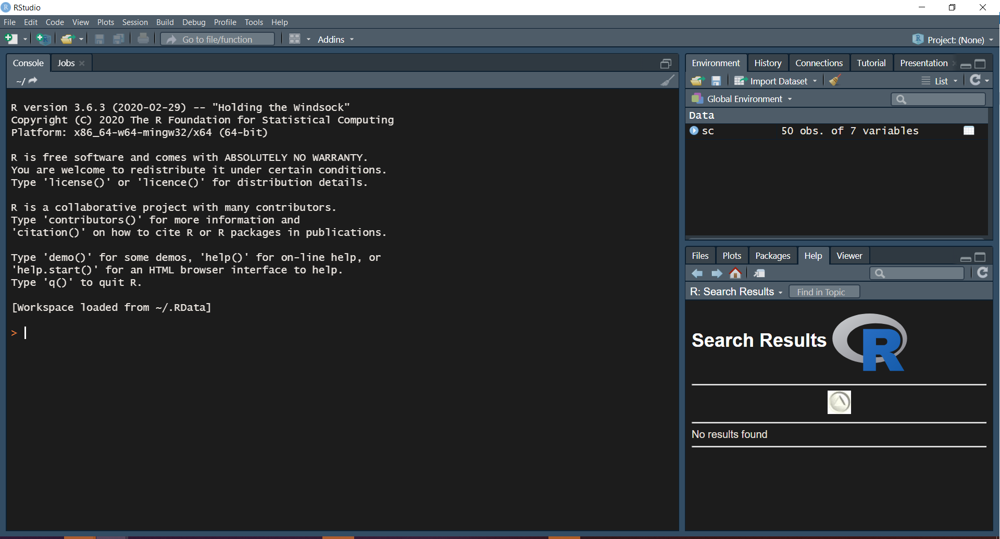
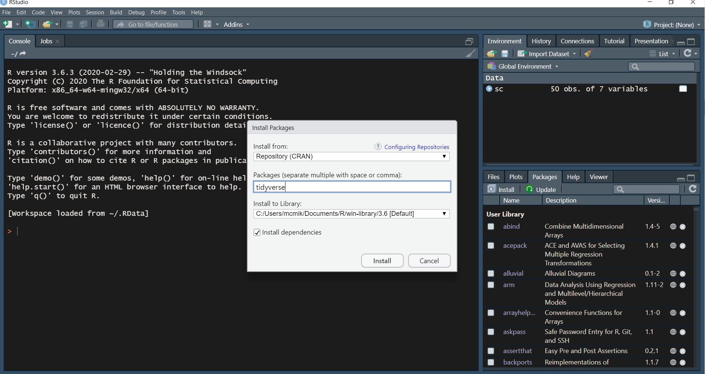

# Installing the software

Rstudio provides a good [starting point for beginners](https://education.rstudio.com/learn/beginner/) to learn R and Rstudio.

In particular, the first chapter of moderndive and the first chapter of R for data science.

## What do you need?

We assume you have a laptop (Windows or Mac). To be able to follow the course and use the software for other courses you need the following free software:

- R
- Rstudio
- TinyTex
- R packages

R is free software for importing data, manipulating data and statistical analysis. Once installed, you don't need to open the software.

We will use R in another program: Rstudio. Rstudio is a so called Integrated Development Environment (IDE), which allows you to write and run code.

Rstudio is able to transform your code to different nice outputs:

- notebook
- presentation
- article
- thesis
- much more (even this website and this course manual is build in Rstudio!)

Rstudio needs TinyTex to transform your code to pdf (which is our preferred format, however other formats are also possible).

If you need to do things more often, it is useful to write a function to do these things. Other R users also use functions and store them in packages. Some of these packages are published online and can be used by all users. We will depend in our course on some of these packages.

The first package we will install is the package TinyTex, which is basically a function to install the TinyTex software on your computer, taking into account your operating system.

We also show you how to install other packages.

In this chapter we will instruct how to install the software.

## Installing R

In this paragraph we will take you through the steps to install R.

1. Go to this [website](https://mirror.lyrahosting.com/CRAN/)
2. Choose download R for your operating system. You can choose from Windows, Mac OS X for apple computers and Linux. If you don't know which operating system you have and you don't have an apple computer, you may guess you have a Windows computer.
3. After downloading, open the downloaded file and follow the steps to install the program. Choose the default options.

## R studio

You can download and install R studio from http://www.rstudio.com/download. Choose the option: "Open Source License Free". The website will then recommend a version for your operating system.

You will see 3 "panes":

1. Console (left part of the screen)
2. Environment/history etc (top right of your screen)
3. Files/Plots/Packages (bottom right of your sreen)

You can test the installation by typing

1 + 1 

followed by an enter to test the installation.

## Installation of TinyTex

LaTeX is a commonly used open source typesetting system; it includes features designed for the production of technical and scientific documentation. LaTeX is the used often in preparing scientific documents.
Latex and R-studio can work together. So you can transform your Rmd documents to pdf via the "knit" button.
TinyTex is a Latex distribution that works on MAC, Windows and Linux operating systems.

We have to install TinyTex in 2 steps:

Run this command in your console (button at the left bottom of your screen)

- Step 1

install.packages('tinytex')

tinytex::install_tinytex()

- Step 2

 writeLines(c(
   '\\documentclass{article}',
   '\\begin{document}', 'Hello world!', '\\end{document}'
 ), 'test.tex')
tinytex::pdflatex('test.tex')

## Installation of packages

In the pane at the bottom right there is a tab called "Packages" (see screenshot above).
After clicking this tab a new tab "Install" appears

After clicking the "Install" button, you can type tidyverse in the pop-up.

Please install the package tidyverse.

