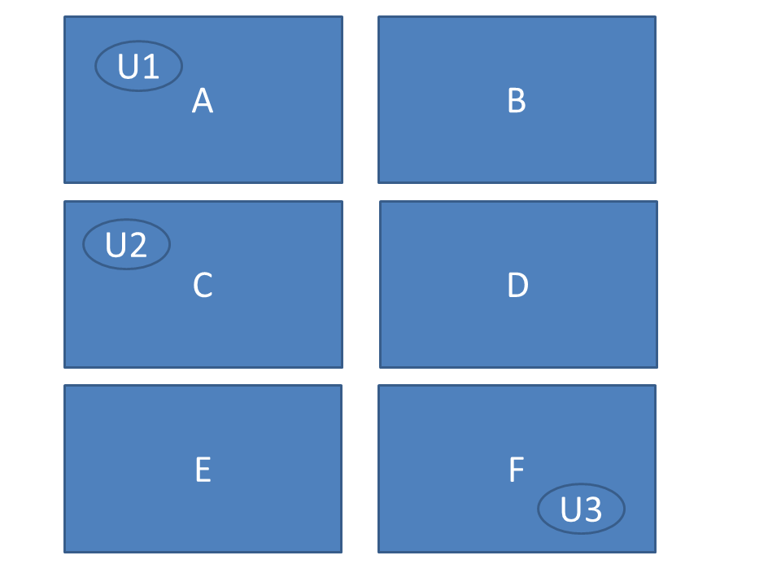

load libraries
```{r, message=FALSE, warning=FALSE}
library(tidyverse)
library(mlogit)
library(ggrepel)
```


# Introduction
The purpose of this notebook is to give an example how you can calculate the LOCI index.

Consider a simple University market consisting of three universities. Each university offers a Economics Msc programme. In this market we have students choosing their master program based on their preferences. Their preferences are determined by their own characteristics and on the university's characteristics. Let us say that an important factor for their preferences are the distance between where they are currenty living and the university and their gender. 

Schematic discription of the market:



Currently, the prices are fixed by the government. Next year the government want to free the prices. We have been asked to do an analyses on the competitve pressure that the universities currently have on each other.


# data 
Let say we have acces to a dataset that contains the university choices that students have made in the past year, including their relevant characteristics. 

Let's read them.
```{r}
dt <- read.csv2("logitdata.csv")
```

Let's check it out

```{r}
head(dt,9)
```

For each student, has her unique ID: "studentID". We can observe that for each student we have her "zipcode", "gender" (1 is male), and the "time" (traveltime) from her zipcode to each University. We also have a column "choice". When choice==1, it means that the student has chosen that corresponding university. 


Let's dig deeper into the data.

A summary of the data
```{r}
summary(dt)
```

Number of students per University
```{r}
dt %>% 
  filter(choice==1) %>% 
  group_by(alternative) %>% 
  summarise(n(), .groups = 'drop')
```

Number of students in each zipcode

```{r}
dt %>% 
  filter(choice == 1) %>% 
  group_by(zipcode) %>% 
  summarise(n(), .groups = 'drop')
```


Number of students per gender

```{r}
dt %>% 
  filter(choice == 1) %>% 
  group_by(gender) %>% 
  summarise(n(), .groups = 'drop')
```


# Underlying utility and calculate Loci 

In this case we could have the following specification for the utility that a student of type $t$ would receive if she would go to university $j$ 
$$
	V_{tj} =  \beta_1 distance_{tj} + \beta_2 Gender_t distance_{tj} + \varepsilon_{tj}
$$

Remember, the LOCI formula in terms of observed market shares is 
		$$\Lambda_{j}= \displaystyle \sum_t w_{tj}(1-s_{tj})$$
		
		weighted by the relative importance of each consumer type
$$		w_{tj}= \frac{N_{t} s_{tj}}{\displaystyle \sum_t N_{t} s_{tj}} $$


Let's calculate the loci step by step.

first we want to create the micromarkets. Given that we have information that gender and traveltime play a role the in choice process of the students, we could make the micromarket based on student zipcode and gender. 

```{r}
micromarkets  <- dt %>%
    group_by(zipcode, gender,alternative) %>% 
  summarise(n = sum(choice), .groups = 'drop') %>%
  ungroup()
```

```{r}
head(micromarkets, 12)
```

For each micromarket (based on zipcode and gender), we have now the number of students ($N$) that have chosen each alternative.

For the loci we have to calculate the shares $s$ and weights $w$. For example, the share of university 1 in micromarket "A0" is defined by $10/(10+4+0)$. Let's calculate it for all students.

First, calculate the total $N$ per micromarkt.
```{r}
micromarkets <- micromarkets %>%
  group_by(zipcode, gender) %>%
  mutate(N = sum(n)) %>%
 ungroup()

head(micromarkets)
```

Secondly, calculate the shares.
```{r}
micromarkets <- micromarkets %>%
  mutate(s = round(n / N, 2))

head(micromarkets)
```

Let's do the weights $w$ now. The weight of micromarket $t$ for university $j$ is the share of micromarket $t$ in the total volume of university $j$. First we calculate per university the total number of students that have chosen that university.

```{r}
micromarkets <- micromarkets %>%
    group_by(alternative) %>%
    mutate(N_University = sum(n)) %>%
    ungroup()

head(micromarkets)
```

Now calculate the weights

```{r}
micromarkets <- micromarkets %>%
  mutate(w = round(n / N_University, 2))

head(micromarkets)
```

We can now calculate  $$\Lambda_{j}= \displaystyle \sum_t w_{tj}(1-s_{tj})$$

```{r}
result_observed <- micromarkets %>%
    group_by(alternative) %>%
    summarise(Loci = sum(w*(1-s)), .groups = 'drop')

result_observed
```


# Estimate demand model and calculate Loci

A alternative way to calculate the LOCI is th first estimate a logit model and  predict per student the probability that she would choose University.1, University.2 and University.3. There could be different reasons to do this. Maybe we want to consider a counterfactual situation (where for example individuals do not react on prices or quality). Or maybe we want to smooth out the probabilities to create smaller micromarkets. In general, estimating a choice model gives you more insight into which factors are important for the choice process.

We use the package "mlogit". We need to set the data into the "mlogit" format.
```{r}
dt_mlogit <- mlogit.data(dt, 
                         alt.levels = c(" University.1", "University.2", "University.3"), 
                         id.var = "studentID")

head(dt_mlogit)
```

Estimate a simple conditional logit model, where we interact traveltime with gender. We thus have to following specefication in the logit model for each student $i$

$$
	V_{ij} = \beta_1 distance_{ij} + \beta_2 Gender_i distance_{ij} + \varepsilon_{ij}
$$

```{r}
m <- mlogit(choice ~ time + time:gender-1, data = dt_mlogit)
summary(m)
```


Let us predict the choices in steps.

Using the estimated coefficients we can calculate the "value" that student $i$ receive when she would choose university $j$.

$$
	\hat{U}_{ij} = \hat{\beta_1} distance_{ij} + \hat{\beta_2} Gender_i distance_{ij}
$$

Using these utilities we can calculate the probability that student $t$ choose university $j$, denoted by $prob_{ij}$.

$$
prob_{ij} = \frac{\exp(U_{ij})}{\sum_{g \in G} \exp(U_{ig})}
$$

In our case we have that $G={University.1, University.2, University.3}$

First get the estimated coeficients
```{r}
coeficients<-as.numeric(summary(m)$coefficients)

coeficients
```


Second, using our main data, calculate for each student and university $\hat{U}_{ij}$
```{r}
dt <- dt %>% 
  mutate(utility = round(exp(coeficients[1] * time + coeficients[2] * time * gender), 4))

head(dt)
```

Next, we calculate $prob_{ij}$
```{r}
dt <- dt %>% 
  group_by(studentID) %>%
  mutate(utilitySum = sum(utility)) %>% 
  ungroup() %>%
  mutate(prob = round(utility / utilitySum, 4))  

head(dt)
```


Now we can calculate the loci, following the steps that we have taken above.


Make the micromarket based on student zipcode and gender
```{r}
micromarkets_pred  <- dt %>%
    group_by(zipcode, gender, alternative) %>% 
  summarise(n = sum(prob), .groups = 'drop') %>%
  ungroup()

```

Calculate the total per micromarkt
```{r}
micromarkets_pred <- micromarkets_pred %>%
  group_by(zipcode, gender) %>%
  mutate(N = sum(n)) %>%
 ungroup()

```

Calculate the shares
```{r}
micromarkets_pred <- micromarkets_pred %>%
  mutate(s = round(n / N, 2))
```

Calculate total per university 

```{r}
micromarkets_pred <- micromarkets_pred %>%
    group_by(alternative) %>%
    mutate(N_University = sum(n)) %>%
    ungroup()
```

Now calculate the weights

```{r}
micromarkets_pred <- micromarkets_pred %>%
  mutate(w = round(n / N_University, 2))
```

We can now calculate  $$\Lambda_{j}= \displaystyle \sum_t w_{tj}(1-s_{tj})$$ based on estimated probabilities

```{r}
result_predicted <- micromarkets_pred %>%
    group_by(alternative) %>%
    summarise(Loci = sum(w * (1-s)), .groups = 'drop')

result_predicted
```

We will compare the results of the observed market shares versus the predicted market shares.

```{r}
graph_data <- left_join(result_observed, result_predicted, by = "alternative")
```

Plot:

```{r}
ggplot(data = graph_data, aes(x = Loci.x, y = Loci.y, label = alternative)) +
  geom_point(color = "firebrick", size = 2) +
  geom_abline(intercept = 0, slope = 1, color = "blue") +
  xlim(0, 1) +
  ylim(0,1) +
  geom_text_repel() +
  xlab("observed loci") +
  ylab("predicted loci") +
  theme_classic()
```


